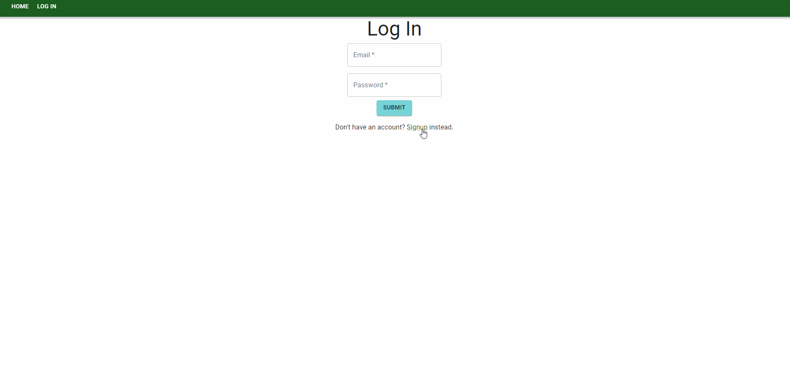

# Cinegraph

## Description

Cinegraph is React based data visualization and modeling application which accepts queries from users to chart relational data about movies. Users can sign up and log in to the application to search for and save movie queries which are stored on a cloud database.

## Usage

The website is deployed on [Heroku](https://movie-data-model.herokuapp.com/)
Upon arrival, you can log in using the email 'example@example.com' and the password 'example'
Once logged in, follow the link to dashboard to see the current graph of charted data. Use the search bar on the left to query the movie database. If there are multiple movies with that title, you will be prompted to enter a year. Then you can submit the returned film to add it to your chart. Use the drop-down menu on the right to remove entries and hover over the plotted points for details on each film.

## Contributors

-   [Jessica Guico](https://github.com/jessicamcg)

-   [Nick Margaritondo](https://github.com/Nickm615)

-   [Jason Xie](https://github.com/jasonluxie)

## Demonstration

### API

-   [OMDb](http://www.omdbapi.com/)

### Framework & Components

-   [MUI](https://mui.com/)

## Further Development

### Dashboard

-   Display movie poster when querying for movies
-   See only movies for each individual user

### Signup

-   OAuth
